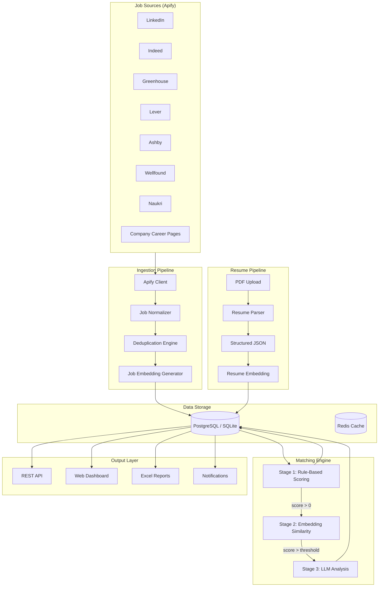

# HuntIQ — Data Flow Specification

> Detailed data flow diagrams for every major pipeline in the system.

---

## 1. Complete System Data Flow



---

## 2. Job Search Flow (Detailed)

```
┌──────────────────────────────────────────────────────────────┐
│                    Job Search Orchestration                    │
│                                                              │
│  1. Scheduler triggers SearchService.run_search()            │
│     │                                                        │
│  2. Load user preferences (keywords, locations, filters)     │
│     │                                                        │
│  3. Get active providers from ProviderRegistry               │
│     │                                                        │
│  4. For each (keyword × location × provider) combination:    │
│     │                                                        │
│     ├── Check search checkpoint (resume interrupted search)  │
│     │                                                        │
│     ├── Execute provider.search_jobs() concurrently          │
│     │   ├── Retry on failure (3 attempts, exponential)       │
│     │   ├── Rate limit per provider                          │
│     │   └── Pagination handling                              │
│     │                                                        │
│     ├── provider.normalize_job() for each raw result         │
│     │                                                        │
│     ├── Deduplication check                                  │
│     │   ├── Exact match: company + role + URL                │
│     │   ├── Fuzzy match: description similarity > 0.95       │
│     │   └── If duplicate: merge, keep newest version         │
│     │                                                        │
│     ├── Generate job embedding                               │
│     │                                                        │
│     ├── Store in database                                    │
│     │                                                        │
│     ├── Save checkpoint                                      │
│     │                                                        │
│     └── Enqueue matching task                                │
│                                                              │
│  5. Log search summary (total found, new, duplicates, time)  │
└──────────────────────────────────────────────────────────────┘
```

---

## 3. Matching Pipeline Flow (Detailed)

```
┌──────────────────────────────────────────────────────────────────┐
│                     Matching Pipeline                             │
│                                                                  │
│  Input: Job record + Active Resume Version                       │
│                                                                  │
│  ┌────────────────────────────────────────────────────────────┐  │
│  │ STAGE 1: Rule-Based Scoring                               │  │
│  │                                                            │  │
│  │ Category           Weight    Method                        │  │
│  │ ─────────          ──────    ──────                        │  │
│  │ Skills Match       25%       Jaccard similarity            │  │
│  │ Role Match         20%       Fuzzy string matching         │  │
│  │ Experience Level   15%       Range overlap check           │  │
│  │ Location Match     10%       Exact + "Remote" handling     │  │
│  │ Tech Stack Match   15%       Weighted overlap              │  │
│  │ Keyword Match      10%       TF-IDF weighted               │  │
│  │ Company Preference  5%       Preferred list bonus          │  │
│  │                                                            │  │
│  │ Disqualifiers (score → 0):                                │  │
│  │ - Blacklisted company                                     │  │
│  │ - Blacklisted keyword in title/description                │  │
│  │ - Experience exceeds max configured                       │  │
│  │                                                            │  │
│  │ Output: rule_score (0–100)                                │  │
│  └────────────────────────┬───────────────────────────────────┘  │
│                           │                                      │
│                    rule_score > 0?                                │
│                      │          │                                 │
│                     YES         NO → STOP (score = 0)            │
│                      │                                           │
│  ┌───────────────────▼────────────────────────────────────────┐  │
│  │ STAGE 2: Embedding Similarity                             │  │
│  │                                                            │  │
│  │ 1. Load resume embedding (cached)                         │  │
│  │ 2. Load job embedding (cached or generate)                │  │
│  │ 3. Compute cosine similarity                              │  │
│  │                                                            │  │
│  │ Output: embedding_score (0.0–1.0, scaled to 0–100)       │  │
│  └────────────────────────┬───────────────────────────────────┘  │
│                           │                                      │
│              combined_score = 0.6 * rule + 0.4 * embed          │
│                           │                                      │
│                combined_score > LLM_THRESHOLD?                   │
│                      │          │                                 │
│                     YES         NO → STOP (final = combined)     │
│                      │                                           │
│  ┌───────────────────▼────────────────────────────────────────┐  │
│  │ STAGE 3: LLM Analysis                                     │  │
│  │                                                            │  │
│  │ 1. Check LLM cache (job_hash + task_type + resume_ver)    │  │
│  │ 2. If cached → return cached response                     │  │
│  │ 3. Build prompt with structured Resume JSON + Job JSON     │  │
│  │ 4. Call LLM provider (with fallback chain)                │  │
│  │ 5. Parse structured LLM response                          │  │
│  │ 6. Cache response                                         │  │
│  │                                                            │  │
│  │ LLM Output:                                               │  │
│  │   - match_explanation (text)                              │  │
│  │   - missing_skills (list)                                 │  │
│  │   - shortlist_probability (0.0–1.0)                       │  │
│  │   - apply_recommendation (yes/no/maybe + reason)          │  │
│  │   - llm_score_adjustment (-10 to +10)                     │  │
│  │                                                            │  │
│  │ final_score = combined_score + llm_score_adjustment       │  │
│  └────────────────────────────────────────────────────────────┘  │
│                                                                  │
│  Store final score + all metadata in database                    │
│  Trigger notification if final_score > notify_threshold          │
└──────────────────────────────────────────────────────────────────┘
```

---

## 4. Resume Processing Flow

```
┌───────────────────────────────────────────────────────────┐
│                  Resume Processing                         │
│                                                           │
│  1. User uploads PDF via API                              │
│     │                                                     │
│  2. Store raw PDF on disk (or object storage)             │
│     │                                                     │
│  3. Parse PDF (PyMuPDF + pdfplumber)                      │
│     │                                                     │
│  4. Extract structured data:                              │
│     │                                                     │
│     │  {                                                  │
│     │    "name": "...",                                   │
│     │    "email": "...",                                  │
│     │    "phone": "...",                                  │
│     │    "summary": "...",                                │
│     │    "skills": ["Python", "Java", ...],              │
│     │    "technologies": ["Docker", "K8s", ...],         │
│     │    "experience": [                                  │
│     │      {                                             │
│     │        "company": "...",                            │
│     │        "role": "...",                               │
│     │        "duration": "...",                           │
│     │        "description": "...",                        │
│     │        "technologies": [...]                        │
│     │      }                                             │
│     │    ],                                              │
│     │    "education": [...],                              │
│     │    "projects": [...],                               │
│     │    "certifications": [...],                         │
│     │    "achievements": [...],                           │
│     │    "keywords": [...]                                │
│     │  }                                                  │
│     │                                                     │
│  5. Store structured JSON in resume_versions table        │
│     │                                                     │
│  6. Extract skills → resume_skills table                  │
│     │                                                     │
│  7. Generate embedding from structured text               │
│     │                                                     │
│  8. Store embedding in resume_embeddings table            │
│     │                                                     │
│  9. Mark as active version (if requested)                 │
│     │                                                     │
│  10. Optionally trigger re-matching against existing jobs │
└───────────────────────────────────────────────────────────┘
```

---

## 5. Notification Flow

```
┌──────────────────────────────────────────────────────┐
│                Notification Pipeline                  │
│                                                      │
│  Trigger Events:                                     │
│  ├── New high-scoring match found                    │
│  ├── Favorite company posted new job                 │
│  ├── Daily report generated                          │
│  └── Application stage changed                       │
│                                                      │
│  1. Check notification rules:                        │
│     ├── Score > notification_threshold?              │
│     ├── Company in favorites?                        │
│     ├── Job posted < 24h ago?                        │
│     ├── Salary > minimum?                            │
│     └── NOT a duplicate notification?                │
│                                                      │
│  2. If rules pass → build notification payload       │
│                                                      │
│  3. Route through configured channels:               │
│     ├── Email (SMTP)                                 │
│     ├── Desktop (native notification)                │
│     └── Webhook (configurable URL)                   │
│                                                      │
│  4. Log notification in notifications table          │
│                                                      │
│  5. Mark notification as delivered/failed             │
└──────────────────────────────────────────────────────┘
```

---

## 6. Report Generation Flow

```
┌──────────────────────────────────────────────────────────┐
│                Report Generation Pipeline                 │
│                                                          │
│  1. Scheduler triggers ReportService.generate_daily()    │
│     │                                                    │
│  2. Query database for:                                  │
│     ├── Top matches (scored > threshold)                 │
│     ├── New jobs (last 24h)                              │
│     ├── Remote opportunities                             │
│     ├── Startup jobs (company.type = startup)            │
│     ├── MNC jobs (company.type = mnc)                    │
│     ├── Applied jobs + status                            │
│     ├── Bookmarked jobs                                  │
│     ├── Recruiter contacts                               │
│     ├── Skill gap analysis                               │
│     └── Search statistics                                │
│     │                                                    │
│  3. Build pandas DataFrames per worksheet                │
│     │                                                    │
│  4. Generate Excel workbook (openpyxl):                  │
│     ├── Conditional formatting (color-coded scores)      │
│     ├── Frozen header panes                              │
│     ├── Auto-fitted column widths                        │
│     ├── Data filters on all columns                      │
│     ├── Clickable hyperlinks for job URLs                │
│     └── Summary statistics row                           │
│     │                                                    │
│  5. Save report to configured path                       │
│     │                                                    │
│  6. Store report metadata in reports table               │
│     │                                                    │
│  7. Notify user that report is ready                     │
└──────────────────────────────────────────────────────────┘
```

---

## 7. Authentication Flow

```
┌──────────────────────────────────────────────────────┐
│                Authentication Flow                    │
│                                                      │
│  Registration:                                       │
│  POST /api/auth/register                             │
│  ├── Validate input (Pydantic)                       │
│  ├── Hash password (bcrypt)                          │
│  ├── Store user                                      │
│  └── Return user (no password)                       │
│                                                      │
│  Login:                                              │
│  POST /api/auth/login                                │
│  ├── Validate credentials                            │
│  ├── Generate access token (JWT, 30 min)             │
│  ├── Generate refresh token (JWT, 7 days)            │
│  └── Return tokens                                   │
│                                                      │
│  Protected Routes:                                   │
│  GET /api/jobs                                       │
│  ├── Extract JWT from Authorization header           │
│  ├── Decode and validate token                       │
│  ├── Inject current_user into route handler          │
│  └── Scope all queries to user_id                    │
│                                                      │
│  Token Refresh:                                      │
│  POST /api/auth/refresh                              │
│  ├── Validate refresh token                          │
│  ├── Generate new access token                       │
│  └── Return new access token                         │
└──────────────────────────────────────────────────────┘
```
